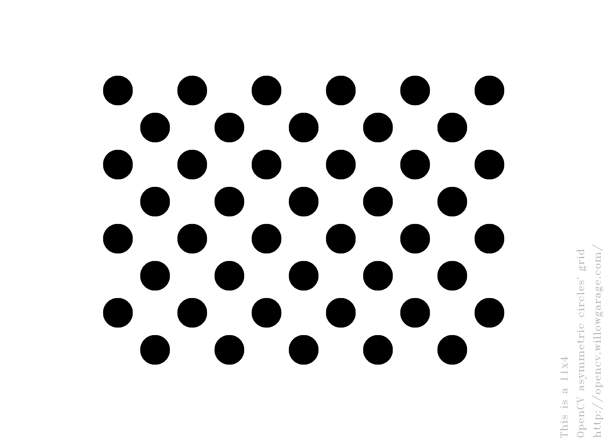

# Camera Pose Calibration

## Table of contents
- [Prerequisites](#prerequisites)
- [Description](#description)
- [Assumptions](#assumptions)
- [Pattern](#pattern)
- [Services](#services)
- [Planned features](#planned-features)

## Prerequisites
Install ROS: [http://wiki.ros.org/ROS/Installation](http://wiki.ros.org/ROS/Installation)

## Description
This package calculates the pose (extrinsics) of a camera with respect to a fixed frame.
The output transform between the camera frame and fixed frame is optionally published on the ROS server, connecting the tf tree.
The package expects as input an image and a registered point cloud with the OpenCV asymmetric circle pattern clearly visible in the image.

## Assumptions
- The tf between camera and asymmetric circle pattern is static (does not change over time)
- The tf of the asymetric circle pattern and the fixed frame is published on the ROS server
- The asymmetric circle pattern can be detected in the image, and registered point cloud data is available for the corresponding points
- This package works only for the OpenCV asymmetric circle pattern because the pose of an asymmetric circle pattern is uniquely defined.
- Other standard calibration patterns such as chessboard pattern and circles pattern do not have this property and because of that not supported by this package.

## Pattern
The asymmetric circle pattern can be taken from [https://docs.opencv.org/2.4/_downloads/acircles_pattern.png](https://docs.opencv.org/2.4/_downloads/acircles_pattern.png):

Print this pattern and mount it on a known pose with respect to fixed frame.

Considering this example image of the asymmetric circle pattern of width 4 and height 11:
- The right-top corner blob is defined as the origin.
- The x-axis points to the left.
- The y-axis points down.
- The z-axis points from your screen towards you.

The tf from calibration tag to the fixed frame should be published on the ROS server.
One way to do this is by supplying this as a link in the URDF and bringing the tf's of the URDF to the ROS server.
Alternatively, this tf can be published by a static transform publisher.

## Services
Three services are provided, choose whatever service you need:
All three of them perform the same processing for calibration.
They differ only in the way the image and point cloud is passed.
- /calibrate_call: The image and point cloud data is given in the service call request.
- /calibrate_file: The image and point cloud path is given, the calibration is performed with these files, useful for debugging with saved data.
- /calibrate_topic: The image and point cloud are received from the ROS server.

Configuration parameters are given in the service call request:
- `tag_frame`: Name of the asymmetric circle frame on the ROS server
- `target_frame`: Tf frame to connect camera to
- `point_cloud_scale_x`: Optional scale factor between image and point cloud (default 1)
- `point_cloud_scale_y`: Optional scale factor between image and point cloud (default 1)
- `pattern`: Pattern msg type with distance and size of the asymmetric circles pattern, more details explained here: [Pattern msg](#pattern-parameters-msg).

The detection of the asymmetric circle pattern will commence after calling the service.
The pose of the camera to the fixed frame will then be returned and optionally published.

### Pattern parameters msg
The `patternParametersMsg` contains the following fields:
- `pattern_width` and `pattern_height`: The number of circles in horizontal and vertical direction, as defined by OpenCV: [https://docs.opencv.org/3.0-beta/doc/tutorials/calib3d/camera_calibration/camera_calibration.html](https://docs.opencv.org/3.0-beta/doc/tutorials/calib3d/camera_calibration/camera_calibration.html)
- `pattern_distance`: The circle center-to-center distance of the printed pattern.
- `neighbor_distance`: Optional averaging of point cloud's (x, y, z) values within certain distance in pixels
- `valid_pattern_ratio_threshold`: Optional acceptance threshold for the ratio of valid points to point cloud's NaN values

## Planned features
- Correction for perspective in determining the blob center.
- Create services for calibrating with two intensity images and the reprojection matrix
